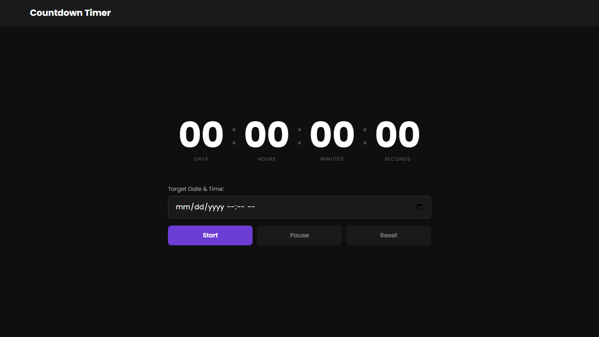
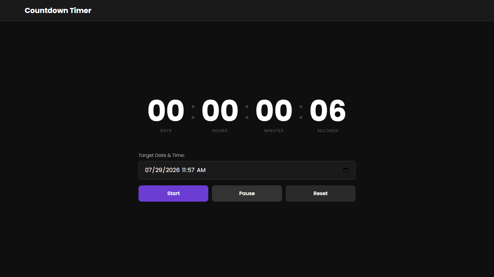
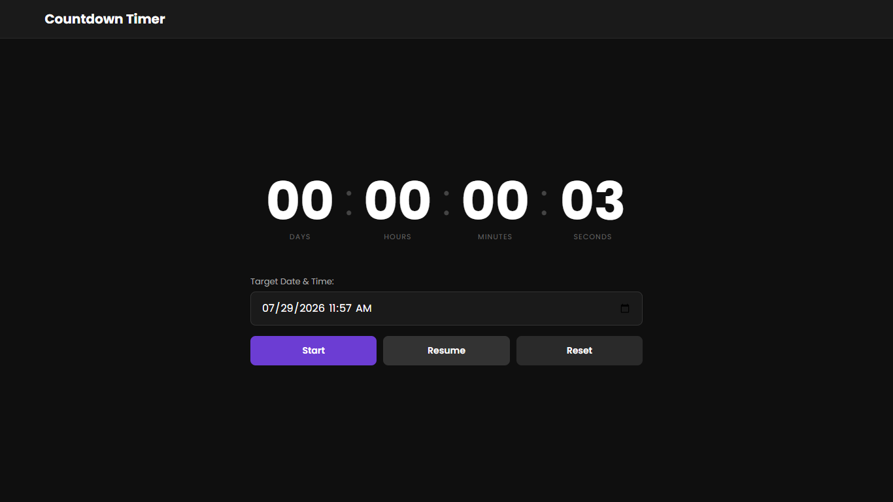
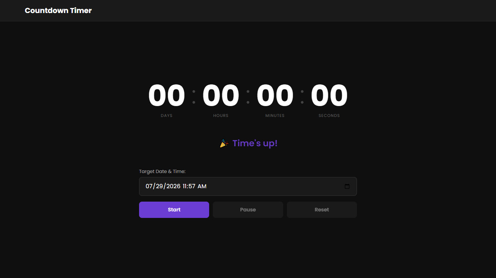

# Countdown Timer

A dark-themed countdown timer that counts down to any target
date and time, with pause, resume, and reset controls.

## Live Demo

[https://ifeanyi234.github.io/countdown-timer/]

## Screenshots

**Default State:**

**Countdown Running:**

**Paused State:**

**Time's Up State:**

## Features

- Set any future date and time as the target
- Live countdown in Days, Hours, Minutes, Seconds
- Pause and resume without losing remaining time
- Reset clears everything back to default
- Finished message when countdown reaches zero
- Guards against stacking multiple intervals
- Validates empty input and past dates

## Tech Stack

HTML, CSS, JavaScript (no frameworks)

## What I Learned

- Timestamp-based countdown using getTime() difference
- Converting milliseconds into days, hours, minutes, seconds
- Pause/resume by clearing and restarting the interval
- Guarding against interval stacking with clearInterval before start
- Button state management with disabled property

## Known Limitations

- Target time is lost on page refresh
- No sound or notification when timer reaches zero

## What I'd Improve With More Time

- Add an alarm sound on completion
- Persist the target date across page refresh
- Add a progress bar showing percentage of time elapsed
